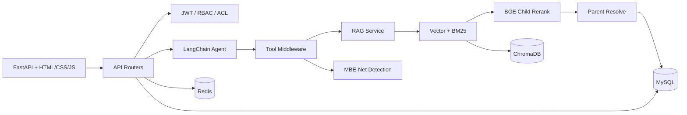

# SAR-Sense

面向 SAR 舰船检测的 Agentic RAG 智能分析平台。项目将领域知识检索、
复杂 PDF 解析、MBE-Net 舰船检测和多工具 Agent 统一到一个 FastAPI
应用中，并提供知识库管理、文件级权限控制、历史会话与可观测性页面。

## 核心亮点

- **Agent 工作流**：基于 LangChain `create_agent`（LangGraph runtime）编排
  RAG、OCR、联网搜索、海况查询和舰船检测等工具，通过 Middleware 统一完成
  工具监控与动态 Prompt 切换；针对跨文档、多轮检索与复杂技术比较，增加隔离上下文的 SAR Research 子智能体（sar-researcher），由主智能体按任务复杂度动态委派，子智能体执行轨迹与 RAG 来源分别桥接回父会话，主链路（SSE / 存库 / 并发）零侵入。
- **混合 RAG**：ChromaDB 向量召回与 BM25 动态融合，截断候选后执行 BGE
  子块重排，再按排序回表父块；自建 25 题评估集中 Recall@5 从向量基线
  `60%` 提升到完整链路的 `92%`。
- **结构化入库**：MinerU 优先解析 PDF 文本、表格和公式，支持中英文自适应
  语义分块；表格与公式按原子块保存，失败时自动回退 PyPDFLoader。
- **工程化存储**：MySQL 保存用户、会话、知识库元数据、父块与指标事件，
  ChromaDB 保存版本化子块向量；入库采用 generation 发布，失败版本不会进入召回。
- **安全隔离**：JWT、实时 RBAC 与文件级 ACL 同时约束列表、下载、向量召回、
  BM25、重排和父块回表，避免无权限正文进入模型上下文。
- **流式与并发**：FastAPI SSE 返回状态、思考步骤、工具事件和最终回答；
  同步 Agent 由有界线程池执行，请求使用独立事件队列桥接。

## 架构



完整检索链路：

```text
查询
  -> ACL 计算 allowed_doc_ids
  -> Chroma 向量召回 + 授权 BM25 召回
  -> 动态加权 RRF 融合并截断
  -> BGE 子块重排
  -> 父块批量回表与二次权限校验
  -> LLM 生成回答与结构化引用
```

## 技术栈

- Python 3.10、FastAPI、SQLAlchemy 2.0、MySQL 8、Redis
- LangChain / LangGraph、Ollama 或 DashScope、SSE
- ChromaDB、BM25、BGE Reranker、MinerU
- PyTorch、自定义 MBE-Net / Ultralytics 检测运行时
- Docker Compose、Nginx

## 快速开始

### 1. 本地运行

准备 Python 3.10、MySQL 8、Redis，以及 Ollama 或可用的云端聊天模型。

```powershell
conda create -n sar-sense python=3.10 -y
conda activate sar-sense

# CPU 版；NVIDIA 环境请按 PyTorch 官方命令安装对应 CUDA wheel。
pip install torch==2.12.0 torchvision==0.27.0 `
  --index-url https://download.pytorch.org/whl/cpu
pip install -r requirements.txt

Copy-Item .env.example .env
```

在 MySQL 中创建数据库：

```sql
CREATE DATABASE sar_sense
  CHARACTER SET utf8mb4
  COLLATE utf8mb4_unicode_ci;
```

编辑 `.env`，至少填写 MySQL 连接信息、`JWT_SECRET`、`ADMIN_PASSWORD`
以及当前模型所需的 API Key。本地没有 Redis 时可设置：

```dotenv
TRAFFIC_CONTROL_ENABLED=false
```

默认聊天模型使用 Ollama：

```powershell
ollama pull qwen3.5:4b
python api_server_fastapi.py
```

访问：

- 应用：<http://localhost:5000>
- OpenAPI：<http://localhost:5000/docs>
- 健康检查：<http://localhost:5000/api/health>

### 2. Docker Compose

先复制并填写 `.env.example`。Compose 会拒绝空的 MySQL 密码、JWT 密钥和
管理员密码。

```powershell
python -c "import secrets; print(secrets.token_urlsafe(48))"
docker compose up --build
```

容器持久化 MySQL、`data/`、ChromaDB、BM25 缓存、日志及 Hugging Face
模型缓存。若 Ollama 运行在宿主机，应用默认通过
`host.docker.internal:11434` 访问。

## 测试与评估

```powershell
python -m compileall api agent rag repositories services utils models schemas
python -m unittest discover -s tests
python -m eval_rag25.evaluate --help
```

检索消融结果见
[eval_rag25/results/ablation_table.md](eval_rag25/results/ablation_table.md)。

## 目录说明

```text
agent/          Agent、工具与 Middleware
api/            FastAPI 应用、鉴权和路由
rag/            入库、混合检索、重排与父块回表
repositories/   同步 RAG/指标持久化边界
crud/           请求侧异步数据库操作
models/         SQLAlchemy ORM 模型
schemas/        Pydantic 请求/响应模型
services/       文件抽取、上传与检测服务
ultralytics/    为 MBE-Net 裁剪的检测专用运行时
eval_rag25/     25 题 RAG 消融评估
```

## 数据与密钥

`.env`、原始知识库、上传文件、ChromaDB、日志、缓存和训练产物均被
`.gitignore` / `.dockerignore` 排除。仓库只保留运行所需的
`best.pt`，不会提交个人文档或本地数据库。

## 第三方许可

`ultralytics/` 是基于 Ultralytics `v8.3.9` 修改的检测专用子集，保留代码
遵循其 [GNU AGPL-3.0 许可](ultralytics/LICENSE)，修改说明见
[ultralytics/README.md](ultralytics/README.md)。项目其余自有代码的发布许可
请在正式公开前单独确认。
