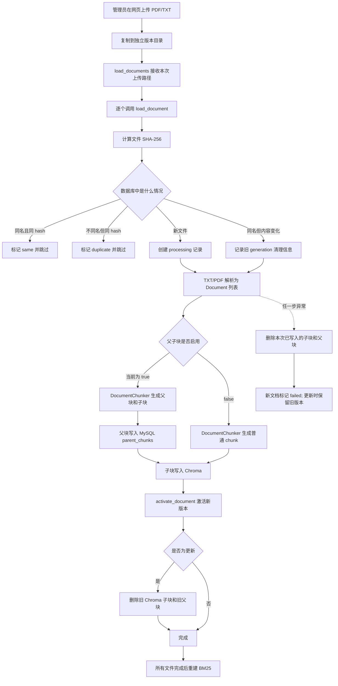

# RAG 知识库入库代码详解

本文只讲当前主线代码中的知识库入库流程，重点解释：

- `api/routers/knowledge.py` 如何接收网页上传文件。
- `rag/vector_store.py` 如何编排一次完整入库。
- `rag/document_chunker.py` 如何生成父块和子块。
- 原始文件、MySQL、Chroma 和 BM25 分别保存什么。
- 新增、重复、更新、失败和删除分别如何处理。

迁移脚本、旧 JSON 存储和测试代码不在本文范围内。

## 1. 先记住两个文件的分工

不要一开始逐行阅读。先建立下面这个心智模型：

| 文件 | 角色 | 负责什么 | 不负责什么 |
|---|---|---|---|
| `rag/vector_store.py` | 入库流程编排器 | 查重、判断新增或更新、调用解析和分块、写入各存储、清理旧版本、重建 BM25 | 不关心语义分块算法内部细节 |
| `rag/document_chunker.py` | 文档分块器 | 固定分块、语义分块、MinerU 结构化分块、父子块构造、metadata 和 ID 生成 | 不连接 MySQL，不写 Chroma，不处理 API |

一句话概括：

> `VectorStoreService` 决定一次入库按什么顺序执行，`DocumentChunker` 只负责把已经解析出来的 `Document` 切成可以保存的块。

## 2. 当前项目实际走哪条入库路线

根据 `config/chroma.yml`，当前关键配置为：

```yaml
semantic_chunking_enabled: true
parent_child_enabled: true
mineru_structured_split: true
```

因此当前主路线不是普通的“切块后全部写 Chroma”，而是：

```text
文件
  -> TXT/PDF 解析
  -> 生成较完整的父块
  -> 父块继续切成较短的子块
  -> 父块正文写 MySQL parent_chunks
  -> 子块正文和向量写 Chroma
  -> 文档清单与当前有效 chunk_ids 写 MySQL knowledge_documents
  -> 重建 BM25
```

PDF 如果经过 MinerU 结构化解析，还会区分：

```text
text     -> 语义分块
table    -> 整张表作为原子块，不再切碎
equation -> 整个公式作为原子块，不再切碎
```

## 3. 五种存储分别保存什么

一次成功入库会涉及多个存储位置：

| 存储 | 保存内容 | 主要用途 |
|---|---|---|
| `data/.knowledge_versions/<uuid>/` | 上传的原始 PDF/TXT 文件 | 下载、溯源和版本替换 |
| MySQL `knowledge_documents` | `doc_id`、文件名、SHA-256、权限、状态、当前有效 `chunk_ids`、块数量 | 文档元数据和有效版本的权威记录 |
| MySQL `parent_chunks` | 父块完整正文与 metadata | 子块命中后回表，给 LLM 更完整的上下文 |
| Chroma | 子块正文、metadata、embedding | 向量召回短而精确的子块 |
| BM25 内存及缓存 | 当前有效子块的关键词索引 | 关键词召回，与向量召回融合 |

注意：MySQL、Chroma 和文件系统之间不存在同一个数据库事务。因此代码采用“先写新版本，激活成功后再删旧版本”的方式降低更新失败造成的数据损失。

## 4. 完整入库流程图



### `VectorStoreService.__init__()` 组装了哪些组件

创建 `VectorStoreService` 时，它会把入库和检索需要的组件组装起来：

```python
self.knowledge_repository = KnowledgeRepository()
self.chunker = DocumentChunker(chroma_conf, embed_model)
self.vector_store = Chroma(...)
self.hybrid_engine = DynamicHybridRetriever(...)
```

如果父子块功能开启，还会创建：

```python
self.parent_docstore = ParentChunkRepository()
```

这些属性的含义如下：

| 属性 | 实际对象 | 职责 |
|---|---|---|
| `knowledge_repository` | `KnowledgeRepository` | 同步读写 MySQL 中的知识库文档元数据 |
| `chunker` | `DocumentChunker` | 负责所有分块计算，不做持久化 |
| `vector_store` | LangChain `Chroma` | 保存子块正文、metadata 和向量 |
| `hybrid_engine` | `DynamicHybridRetriever` | 提供向量与 BM25 混合检索，并负责 BM25 重建 |
| `parent_docstore` | `ParentChunkRepository` | 保存和读取 MySQL 父块 |

所以 `VectorStoreService` 自己不重新实现这些组件的内部工作，它负责协调它们的执行顺序。

## 5. 第一步：网页上传入口做了什么

入口是 `api/routers/knowledge.py` 中的 `upload_knowledge()`。

它在进入 `VectorStoreService` 之前完成以下工作：

1. `require_admin` 确认当前用户是管理员。
2. `rate_limit` 限制上传频率。
3. `_parse_allowed_roles()` 解析文件可见角色。
4. `redis_lock` 保证同一时间只有一个知识库写操作。
5. `_copy_upload_to_version()` 把上传文件复制到独立版本目录。
6. 收集本次上传成功的绝对路径到 `uploaded_paths`。
7. 在线程池中调用 `vector_store.load_documents()`。

调用代码：

```python
runtime_result = await run_in_threadpool(
    vector_store.load_documents,
    uploaded_paths,
    allowed_roles=roles,
    updated_by=admin.get("id"),
    return_details=True,
)
```

这里没有写成 `load_documents(...)`，是因为传给 `run_in_threadpool` 的是函数对象。线程池内部最终执行的等价代码是：

```python
vector_store.load_documents(
    uploaded_paths,
    allowed_roles=roles,
    updated_by=admin.get("id"),
    return_details=True,
)
```

这样 PDF 解析、embedding、Chroma 写入和同步数据库操作不会直接阻塞 FastAPI 的异步事件循环。

## 6. 第二步：`load_documents()` 处理一批文件

`load_documents()` 是批量包装层。它不实现真正的入库算法，只做三件事：

1. 接收一个文件路径列表。
2. 每次取一个路径，调用 `load_document(file_paths=[path])`。
3. 汇总每个文件的新增、更新、跳过、删除和错误信息。

可以把它简化理解成：

```python
for path in file_paths:
    result = load_document(file_paths=[path], return_details=True)
    aggregate += result
return aggregate
```

逐个文件调用的好处是，一个文件失败不会阻止同一批次中其他文件继续入库。

### `return_details` 的作用

`return_details=False` 仍然会返回结果，只是不返回每个文件的详细信息：

```python
(new_count, updated_count, skipped_count, removed_count)
```

`return_details=True` 返回：

```python
{
    "new_count": 1,
    "updated_count": 0,
    "skipped_count": 0,
    "removed_count": 0,
    "files": [
        {
            "filename": "SFQ-Det.pdf",
            "doc_id": "...",
            "status": "new",
            "success": True,
            "storage_key": ".knowledge_versions/.../SFQ-Det.pdf",
            "previous_storage_key": None,
            "error": None,
        }
    ],
}
```

网页必须使用详细结果，因为上传接口需要知道哪个文件失败、重复或更新，并据此删除不用的临时版本文件。

## 7. 第三步：`load_document()` 决定处理哪些文件

`load_document()` 是整个入库流程的核心编排函数。

### 模式 A：指定文件模式

网页上传传入：

```python
file_paths=[本次上传文件路径]
```

此时只处理指定文件：

```python
cleanup_missing = False
```

它不会扫描整个 `data/`，也不会因为某个数据库文件没有出现在本次上传列表中就删除它。

### 模式 B：全量同步模式

直接调用：

```python
load_document()
```

由于 `file_paths is None`，代码会扫描 `data_path` 下所有允许类型的文件，并补充数据库中记录的有效版本路径：

```python
allow_files_path = list(
    listdir_with_allowed_type(data_path, allowed_types)
)
```

此时：

```python
cleanup_missing = True
```

处理完成后，数据库中存在但磁盘上不存在的文档会被视为失效文档并删除。

当前文件底部：

```python
if __name__ == "__main__":
    vs = get_vector_store_service()
    vs.load_document()
```

因此运行：

```bash
python -m rag.vector_store
```

走的是全量扫描和同步模式。

## 8. 第四步：生成文件身份并判断是否需要入库

每个文件首先生成四个基础值：

```python
filename = os.path.basename(path)
storage_key = get_storage_key(path)
file_hash = get_file_hash(path)
file_type = ...
```

### `filename`

供页面展示，并用于判断“是否存在同名逻辑文档”。

### `storage_key`

保存文件相对于 `data/` 的稳定路径，例如：

```text
.knowledge_versions/a8f.../SFQ-Det.pdf
```

如果文件不在 `data/` 内，则退化成文件名。它不是向量 ID，也不是文档 ID。

#### 局部函数 `get_storage_key(read_path)`

这个函数就在 `load_document()` 内部，专门把文件路径转换成适合保存到数据库的路径标识。

它的处理步骤是：

1. 将 `read_path` 转成绝对路径。
2. 判断它是否位于配置的 `data_dir` 内。
3. 如果在 `data_dir` 内，返回相对于 `data_dir` 的路径。
4. 把 Windows 的反斜杠 `\` 统一转换成 `/`。
5. 如果路径在 `data_dir` 外，或者 Windows 不同盘符导致 `commonpath()` 抛出 `ValueError`，退化返回文件名。

例如：

```text
data/report.pdf
  -> report.pdf

data/.knowledge_versions/abc123/report.pdf
  -> .knowledge_versions/abc123/report.pdf
```

这样数据库不会保存当前机器专属的绝对路径：

```text
不保存：E:\\sar-sense\\data\\.knowledge_versions\\abc\\report.pdf
保存：  .knowledge_versions/abc/report.pdf
```

这个值后续会被用于：

- API 找到当前文档的原始文件。
- 更新时返回 `previous_storage_key`。
- `_delete_original_file()` 拼接出需要删除的文件路径。

它和 `file_hash` 的区别是：

```text
file_hash   -> 证明文件内容是什么
storage_key -> 说明文件保存在哪里
```

### `file_hash`

`get_file_hash()` 计算文件内容的 SHA-256。它用于：

- 判断内容是否完全相同。
- 为新文档生成 `doc_id`。
- 为本次内容生成 generation 命名空间。

### `file_type`

记录扩展名，例如 `pdf` 或 `txt`。

### 两次数据库查询

```python
existing = repository.get_by_filename(filename)
duplicate = repository.get_by_hash(file_hash)
```

它们回答两个不同问题：

- `existing`：同名文件以前是否入过库。
- `duplicate`：同样内容以前是否以其他文件名入过库。

随后分成四种情况：

| 情况 | 结果 |
|---|---|
| 同名、同 hash、状态 active | `same`，跳过 embedding |
| 不同名、但 hash 已存在且 active | `duplicate`，跳过 embedding |
| 没有同名 active 文档 | `new`，新入库 |
| 同名 active 文档，但 hash 改变 | `updated`，生成新版本后替换旧版本 |

## 9. 第五步：生成 `doc_id` 和 generation

### `doc_id`

新文件使用 SHA-256 前 16 位：

```python
doc_id = file_hash[:16]
```

更新同名文档时继续沿用原来的 `doc_id`：

```python
doc_id = existing.doc_id
```

因此 `doc_id` 表示“逻辑文档”，不会因为同名文档内容更新而变化。

### generation

每一版内容有自己的 generation：

```python
generation = f"{doc_id}:gen:{file_hash[:12]}"
```

例如：

```text
985419bb186328d7:gen:a31f90c42d18
```

generation 进入父块和子块 ID，保证新旧内容使用不同 ID，可以先写新版本，再删除旧版本。

父子块模式下的 ID 层次如下：

```text
doc_id
└── generation
    └── parent_id
        └── child_id
```

具体示例：

```text
文档：  985419bb186328d7
版本：  985419bb186328d7:gen:a31f90c42d18
父块：  985419bb186328d7:gen:a31f90c42d18:parent:003
子块：  985419bb186328d7:gen:a31f90c42d18:parent:003:child:001
```

## 10. 第六步：新文档进入 `processing`

新文档在真正解析前调用：

```python
knowledge_repository.begin_ingestion(...)
```

数据库记录暂时为：

```text
status = processing
chunk_ids = []
chunk_count = 0
```

这表示“已经开始入库，但还没有可供检索的完整版本”。

更新已有文档时不会先把旧记录改成 `processing`。旧版本继续保持 `active`，直到新版本的父块、子块和向量全部写完。这是更新失败时仍能继续检索旧版本的关键。

## 11. 第七步：把文件解析成 LangChain `Document`

`load_document()` 内部的 `get_file_documents()` 只负责选择解析器：

```python
if path.endswith(".txt"):
    return text_loader(path)
if path.endswith(".pdf"):
    return pdf_loader(path)
```

#### 局部函数 `get_file_documents(read_path)`

这是 `load_document()` 内部的文件解析分发器，不负责切块，也不负责写库。

它只根据扩展名选择已有的加载器：

```text
.txt -> text_loader()
.pdf -> pdf_loader()
其他 -> 返回空列表
```

返回结果统一是 LangChain `Document` 列表，所以后面的 `DocumentChunker` 不需要知道文件来自 TXT 还是 PDF。PDF 的 MinerU 结构化 metadata 也是在这个解析阶段进入 `Document` 的，后续 `_structured_split()` 只读取这些 metadata。

解析器输出的是：

```python
Document(
    page_content="正文内容",
    metadata={...},
)
```

这一步还没有生成最终父块或子块，只是把原始文件转成 `Document` 列表。

如果解析结果为空：

```python
raise ValueError("document content is empty")
```

后续会进入失败清理流程。

## 12. 第八步：`DocumentChunker` 选择分块路线

当前 `parent_child_enabled=true`，因此调用：

```python
chunker.build_parent_child_chunks(...)
```

只有关闭父子块时才调用：

```python
chunker.build_chunks(...)
```

`DocumentChunker` 不访问数据库，也不写 Chroma。它只接收 `Document`，返回新的 `Document`、ID 和父块记录。

## 13. `DocumentChunker.__init__()`：准备分块配置

构造函数根据 `chroma.yml` 创建四个固定分块器：

| 分块器 | 用途 |
|---|---|
| `pdf_splitter` | PDF 语义分块失败时的固定分块回退 |
| `txt_splitter` | TXT 语义分块失败时的固定分块回退 |
| `default_splitter` | 未识别文件类型的回退 |
| `child_splitter` | 把父块继续切成用于召回的短子块 |

它还保存：

- 是否启用语义分块。
- 语义断点相似度阈值。
- 中文最小/最大块长度。
- 英文最小/最大块长度。
- 判断中英文的 CJK 占比阈值。

这一步只初始化对象，不会立即切文件，也不会调用 embedding。

## 14. `initial_chunk_method()`：给数据库一个初始方法名

这个函数只返回字符串：

```text
parent_child_semantic
parent_child_fixed
semantic
fixed
```

它在真正分块前为新文档准备初始 `chunk_method`。真正执行后，如果检测到 MinerU 结构化内容或发生固定分块回退，返回的方法名会覆盖初始值。

## 15. `build_parent_child_chunks()`：当前主分块入口

这个函数先决定“父块怎么产生”，再把父块变成父子关系。

判断顺序：

```text
1. 是否为 MinerU 结构化 PDF
   -> 是：_structured_split()

2. 否则是否启用语义分块
   -> 是：_semantic_split()

3. 语义分块关闭或失败
   -> _get_splitter(...).split_documents(...)

4. 调用 _make_parent_child_chunks()
   -> 生成父块记录和 Chroma 子块
```

返回值：

```python
(
    child_chunks,   # 准备写入 Chroma 的子块 Document
    child_ids,      # Chroma IDs
    parent_ids,     # MySQL 父块 IDs
    parent_records, # 准备写入 parent_chunks 的完整父块
    chunk_method,   # 实际使用的分块方法
)
```

## 16. `_structured_split()`：处理 MinerU 结构

MinerU 解析后的每个 `Document` 会带有 `mineru_type`：

```text
text
table
equation
```

这个函数维护一个 `text_buffer`：

- 连续正文先放进缓冲区。
- 遇到表格或公式时，先把正文缓冲区做语义分块。
- 表格作为一个完整父块加入。
- 公式作为一个完整父块加入。
- 文件末尾再刷新剩余正文。

#### 嵌套函数 `flush_text()`

`flush_text()` 是 `_structured_split()` 内部的局部函数，只处理当前缓存中的连续正文，具体步骤是：

1. 如果 `text_buffer` 为空，直接返回。
2. 调用 `_semantic_split()` 将缓存正文切成语义块。
3. 如果语义 embedding 失败，使用 `pdf_splitter` 固定分块作为回退。
4. 给每个正文块补上：

   ```python
   chunk_type = "text"
   mineru_structured = True
   ```

5. 将这些正文父块追加到 `parents`。
6. 清空 `text_buffer`，等待下一段正文。

之所以要在遇到表格或公式前先调用它，是为了保证：

```text
表格/公式前的正文 -> 先形成正文父块
表格/公式       -> 再作为独立原子父块
```

否则表格或公式可能会和前后的普通文本混在同一个语义块中。

### 表格

表格会增加：

```python
chunk_type = "table"
table_id = f"{doc_id}:table:{sequence}"
page = ...
```

`DocumentChunker` 不负责把 HTML 转 Markdown，也不改变表格正文格式。`page_content` 是什么格式，取决于上游 `pdf_loader()` 从 MinerU 结果中放入了什么。

### 公式

公式会增加：

```python
chunk_type = "equation"
page = ...
```

表格和公式在后续 `_make_parent_child_chunks()` 中都不会再被字符切碎。

## 17. `_semantic_split()`：语义分块算法

语义分块不是一次完成的，它分成六步。

### 17.1 判断主要语言

```python
_cjk_ratio(joined_text)
```

统计中文字符和拉丁字母的占比：

- CJK 占比低于阈值，使用英文最小/最大长度。
- 否则使用中文最小/最大长度。

英文阈值更大，是为了避免英文一个句子就形成一个过短父块。

### 17.2 先切成句子级单元

使用换行、句号、问号、感叹号、分号等分隔符，把原始 `Document` 切成较小单元。

如果只有一个单元，直接返回原文档，不再计算 embedding。

### 17.3 对所有句子批量计算 embedding

```python
embedding_model.embed_documents([...])
```

这里使用 embedding 的目的不是入 Chroma，而是比较相邻句子的语义是否连续。

如果 embedding 调用失败，返回 `None`。上层看到 `None` 后改用固定分块，而不是让整次入库失败。

### 17.4 找语义断点

`_cosine_sim(a, b)` 计算相邻句子向量的余弦相似度。

```text
相似度 >= semantic_threshold：继续属于当前主题
相似度 <  semantic_threshold：认为发生话题切换
```

低于阈值的位置会加入 `boundaries`。

### 17.5 合并句子并限制最大长度

断点之间的句子合并成一个块。如果合并后超过 `max_size`，会在句子边界继续拆开，避免生成过长父块。

### 17.6 合并过短块

小于 `min_size` 的块不会直接保留，而是并入相邻块，减少大量只有一两句话的碎片。

最终返回的是较完整的语义父块。

## 18. `_make_parent_child_chunks()`：建立父子关系

这个函数为每个父块生成：

1. 一个 `parent_id`。
2. 一条准备写入 MySQL 的父块记录。
3. 一个或多个准备写入 Chroma 的子块。

### 父块 metadata

主要字段包括：

```python
{
    "doc_id": ...,
    "parent_id": ...,
    "chunk_type": "parent",
    "parent_index": ...,
    "file_hash": ...,
    "source": ...,
    "filename": ...,
    "file_type": ...,
}
```

页面、MinerU 类型、`table_id` 和 `mineru_structured` 等字段也会继续透传。

### 普通正文父块

普通正文使用 `child_splitter` 继续切短：

```python
children = child_splitter.split_documents([parent])
```

短子块更适合向量和 BM25 精确召回。

### 表格和公式父块

```python
if chunk_type in ("table", "equation"):
    children = [parent]
```

即整块同时充当一个子块，不再切分，避免破坏表格行列或公式结构。

### 子块 metadata

每个子块都有：

```python
{
    "doc_id": ...,
    "parent_id": ...,
    "child_id": ...,
    "chunk_id": child_id,
    "chunk_type": "child",
    "parent_index": ...,
    "child_index": ...,
    "file_hash": ...,
    "source": ...,
    "filename": ...,
}
```

`parent_id` 是后续“子块命中后回表取父块”的关键。

## 19. `build_chunks()`：关闭父子块后的备用路线

当 `parent_child_enabled=false` 时才走这个函数：

```text
语义分块开启
  -> _semantic_split()

语义分块关闭或失败
  -> PDF/TXT 固定分块器

最后
  -> _enrich_chunks() 添加 metadata 和 chunk_id
```

它返回：

```python
(chunks, chunk_ids, chunk_method)
```

这些块直接进入 Chroma，不产生 `parent_records`，也不写 `parent_chunks`。

## 20. `_enrich_chunks()`：给普通块补身份信息

这个函数只用于非父子块路线。它给每个普通块添加：

- `doc_id`
- `chunk_id`
- `file_hash`
- `source`
- `filename`
- `file_type`
- `chunk_index`
- 原始页码 `page`，如果存在

使用 generation 时，ID 形如：

```text
985419bb186328d7:gen:a31f90c42d18:0000
```

## 21. `_build_splitter()` 和 `_get_splitter()`

### `_build_splitter()`

根据块大小、重叠大小和 `chroma.yml` 中的分隔符创建 `RecursiveCharacterTextSplitter`。

### `_get_splitter()`

根据文件扩展名选择：

```text
.txt -> txt_splitter
.pdf -> pdf_splitter
其他 -> default_splitter
```

它们主要是语义分块失败时的稳定回退方案。

## 22. 第九步：按顺序写入三个运行时存储

父子块构造完成后，`VectorStoreService` 按以下顺序写入：

### 22.1 父块写 MySQL

```python
parent_docstore.save_batch(parent_records)
```

当前 `parent_docstore` 实际是 `ParentChunkRepository`，不是旧的 JSON `ParentDocstore`。

### 22.2 子块写 Chroma

```python
vector_store.add_documents(
    enriched_chunks,
    ids=staged_child_ids,
)
```

Chroma 在这里调用 embedding 模型，将子块正文转成向量并持久化。

前面语义分块时调用 embedding，是为了找语义断点；这里再次调用 embedding，才是为了建立可检索的向量索引。两次用途不同。

### 22.3 激活知识库文档记录

```python
knowledge_repository.activate_document(...)
```

它将 MySQL 中的文档记录更新为：

```text
status = active
chunk_ids = 本次 generation 的所有子块 ID
chunk_count = 子块数量
parent_count = 父块数量
child_count = 子块数量
allowed_roles = 文件权限
```

从此，当前 generation 才成为系统认定的有效版本。

## 23. 第十步：更新文件时删除旧 generation

更新开始前：

```python
previous = _snapshot_document(existing)
```

它现在只保存真正需要的三个字段：

```python
{
    "chunk_ids": [...],
    "parent_ids": [...],
    "storage_key": "...",
}
```

新版本成功激活后：

1. 删除旧 `chunk_ids` 对应的 Chroma 子块。
2. 删除旧 `parent_ids` 对应的 MySQL 父块。
3. 将旧 `storage_key` 返回给 API。
4. API 删除旧的原始版本文件。

顺序是“新版本激活，旧版本清理”，不是“先删旧版本，再尝试写新版本”。

这使更新过程具备以下性质：

```text
新版本失败 -> 旧 active 版本仍然可用
新版本成功 -> 切换 active 记录，再清理旧数据
```

## 24. 第十一步：失败时清理本次半成品

本次 generation 的 ID 先记录在：

```python
staged_child_ids = []
staged_parent_ids = []
```

如果解析、分块、父块写入、Chroma 写入或激活过程中发生异常，就调用：

```python
_cleanup_staged_generation(
    staged_child_ids,
    staged_parent_ids,
)
```

它尝试：

- 从 Chroma 删除本次已经写入的子块。
- 从 MySQL 删除本次已经写入的父块。

对于新文档，如果已经执行 `begin_ingestion()`，还会：

```python
knowledge_repository.mark_failed(doc_id, error)
```

对于更新文档，旧记录没有提前失活，所以失败时旧版本继续可用。

清理异常只记录 warning，因为跨 MySQL、Chroma、文件系统无法做到真正的原子回滚。运行时通过数据库中的 active `chunk_ids` 过滤召回，即使极端中断留下孤儿向量，它们也不应进入正常检索结果。

## 25. 第十二步：全量同步时清理磁盘缺失文档

只有 `file_paths is None` 的全量同步模式执行这一段：

```python
stale_records = 数据库 active 文档 - 当前磁盘文件
```

每条失效记录调用 `_delete_document_record()`：

1. 数据库状态改为 `deleting`。
2. 删除 Chroma 子块。
3. 按 `doc_id` 删除父块。
4. 删除知识库文档记录。
5. 最后统一重建 BM25。

网页上传使用指定路径模式，因此上传一个文件不会误删其他知识库文件。

## 26. 第十三步：重建 BM25

只要本批次出现：

- 新增文件；
- 更新文件；
- 删除文件；

就执行：

```python
hybrid_engine.rebuild_bm25()
```

如果全部文件都是 `same` 或 `duplicate`，知识库内容没有变化，不需要重建。

BM25 重建失败不会把已经成功写入的知识库回滚，只记录 warning，后续可以重新构建。

## 27. 删除流程中的函数

### `_delete_original_file()`

删除原始文件前先验证目标路径位于配置的 `data/` 目录内，防止路径越界删除项目外文件。

### `_delete_document_record()`

删除流程的共同底层实现：

```text
mark_deleting
  -> 删除 Chroma chunks
  -> 删除 MySQL parents
  -> 可选删除原始文件
  -> 删除 knowledge_documents 记录
  -> 可选重建 BM25
```

### `delete_document()`

按文件名查询文档，然后交给 `_delete_document_record()`。

### `delete_document_by_doc_id()`

按稳定 `doc_id` 查询文档，然后交给 `_delete_document_record()`。API 更适合使用这个入口，因为文件名可能变化或包含特殊字符。

## 28. 检索相关但不属于入库的函数

### `retrieve()`

把查询和当前用户允许访问的 `doc_id` 交给 `DynamicHybridRetriever`：

```python
hybrid_engine.retrieve(query, allowed_doc_ids=...)
```

它属于查询入口，不参与入库。

### `manifest` 属性

从 MySQL 动态生成兼容旧调用方的 manifest 字典：

```python
knowledge_repository.as_manifest()
```

它不再读取或写入根目录的 `manifest.json`。

### `get_vector_store_service()`

使用双重检查锁创建进程内共享的 `VectorStoreService` 实例，避免 API、RAG 工具和知识库管理各自创建一套 Chroma/BM25 对象。

## 29. 两个文件的函数覆盖清单

下面是本文覆盖的两个目标文件中的全部函数，包括 `load_document()` 内部的两个局部函数。

### `rag/vector_store.py`

| 函数 | 所在层次 | 作用 |
|---|---|---|
| `get_vector_store_service()` | 模块函数 | 创建并复用进程内的 `VectorStoreService` |
| `VectorStoreService.__init__()` | 初始化 | 组装 MySQL、分块器、Chroma、混合检索器和父块 Repository |
| `retrieve()` | 查询入口 | 把查询交给混合检索器 |
| `manifest` | 兼容属性 | 从 MySQL 生成旧 manifest 结构 |
| `_snapshot_document()` | 更新辅助函数 | 保存旧版本清理所需的 ID 和路径 |
| `_cleanup_staged_generation()` | 失败清理函数 | 删除本次入库已经产生的半成品 |
| `_delete_original_file()` | 文件删除辅助函数 | 在 `data/` 范围内安全删除原始文件 |
| `_delete_document_record()` | 删除底层函数 | 删除一个文档的 Chroma、父块、原始文件和 MySQL 记录 |
| `delete_document()` | 删除公开入口 | 按文件名删除 |
| `delete_document_by_doc_id()` | 删除公开入口 | 按稳定 `doc_id` 删除 |
| `load_document()` | 单文件/全量入口 | 编排查重、解析、分块、写入、更新和失败处理 |
| `load_documents()` | 批量入口 | 逐个调用 `load_document()` 并汇总结果 |
| `get_file_documents()` | 局部函数 | 根据扩展名选择 TXT/PDF 解析器 |
| `get_storage_key()` | 局部函数 | 将绝对路径转换成安全、可移植的存储路径 |

文件末尾的：

```python
if __name__ == "__main__":
    ...
```

不是函数，而是命令行入口。它调用 `load_document()`，所以默认走全量扫描模式。

### `rag/document_chunker.py`

| 函数 | 作用 |
|---|---|
| `__init__()` | 读取配置并创建各类 splitter |
| `initial_chunk_method()` | 返回预计使用的分块方法名 |
| `build_parent_child_chunks()` | 当前父子块主入口 |
| `build_chunks()` | 关闭父子块时的普通分块入口 |
| `_build_splitter()` | 创建 `RecursiveCharacterTextSplitter` |
| `_get_splitter()` | 根据文件扩展名选择固定分块器 |
| `_cosine_sim()` | 计算两个 embedding 的余弦相似度 |
| `_cjk_ratio()` | 估算文本主要是中文还是英文 |
| `_semantic_split()` | 根据相邻句子语义相似度切父块 |
| `_structured_split()` | 处理 MinerU 的正文、表格和公式结构 |
| `_structured_split()` 内的 `flush_text()` | 将连续正文缓存切成正文父块并清空缓存 |
| `_enrich_chunks()` | 给普通块补齐 metadata 和 ID |
| `_make_parent_child_chunks()` | 把父块生成父块记录和 Chroma 子块 |

阅读这些函数时，可以把带下划线的函数理解为内部实现，把 `build_*()` 理解为分块器对外提供的主要入口。

## 30. 推荐阅读顺序

第一次阅读时只按下面顺序看，先跳过其他辅助函数。

### 第一遍：只看主干

1. `api/routers/knowledge.py::upload_knowledge`
2. `rag/vector_store.py::load_documents`
3. `rag/vector_store.py::load_document`
4. `rag/document_chunker.py::build_parent_child_chunks`
5. `rag/document_chunker.py::_structured_split`
6. `rag/document_chunker.py::_semantic_split`
7. `rag/document_chunker.py::_make_parent_child_chunks`

看完这七个函数，就能理解当前入库主流程。

### 第二遍：理解安全更新

1. `rag/vector_store.py::_snapshot_document`
2. `rag/vector_store.py::_cleanup_staged_generation`
3. `KnowledgeRepository.begin_ingestion`
4. `KnowledgeRepository.activate_document`
5. `KnowledgeRepository.mark_failed`

### 第三遍：理解删除和备用模式

1. `_delete_document_record`
2. `delete_document_by_doc_id`
3. `build_chunks`
4. `_enrich_chunks`
5. `_build_splitter` 与 `_get_splitter`

## 31. 用一个 PDF 例子串起来

假设管理员上传 `SFQ-Det.pdf`：

```text
1. API 将文件保存到：
   data/.knowledge_versions/<uuid>/SFQ-Det.pdf

2. load_documents([path]) 只处理这一个文件。

3. load_document 计算 SHA-256，查询同名记录和同 hash 记录。

4. 新文件得到 doc_id；更新文件沿用原 doc_id。

5. pdf_loader 调用 MinerU，得到 text/table/equation Documents。

6. build_parent_child_chunks 检测到 mineru_structured：
   - 连续 text 做语义父块；
   - table 和 equation 原子保留。

7. _make_parent_child_chunks：
   - 每个父块生成 parent_id；
   - 普通正文父块继续切成多个 child；
   - 表格和公式各自只生成一个完整 child。

8. 父块写 MySQL parent_chunks。

9. 子块计算 embedding 后写 Chroma。

10. knowledge_documents 激活本次 generation，并保存有效 child_ids。

11. 如果是更新，删除旧 generation 的 Chroma 子块和 MySQL 父块。

12. API 删除旧原始版本文件。

13. 重建 BM25。
```

检索时则反向进行：

```text
问题
  -> Chroma + BM25 召回子块
  -> 子块 rerank
  -> 根据 parent_id 回 MySQL 取完整父块
  -> 父块交给 LLM
```

这就是项目使用父子块的核心目的：

> 用短子块提高召回精度，用完整父块保证 LLM 获得足够上下文。

## 32. 最后再压缩成一句伪代码

整个 `load_document()` 可以先记成下面这段：

```python
for file in files:
    identity = 计算文件名、路径和 SHA256
    if 内容没有变化或内容已存在:
        跳过
        continue

    old_generation = 记录旧版本清理信息

    try:
        documents = 解析 TXT/PDF
        parents, children = 分块并建立父子关系
        MySQL.保存父块(parents)
        Chroma.保存并向量化子块(children)
        MySQL.激活当前文档(children.ids)
        删除旧版本(old_generation)
    except Exception:
        删除本次半成品
        保留旧 active 版本

如果知识库发生变化:
    重建 BM25
```

以后再看到 `vector_store.py` 的函数时，只需要判断它属于以下哪一类：

```text
入口与初始化
文件选择与身份判断
调用分块器
写入与版本切换
失败清理
删除
检索兼容入口
```

它们不是一堆彼此无关的函数，而是在共同保护同一条“新版本完整写入后才替换旧版本”的入库链路。
